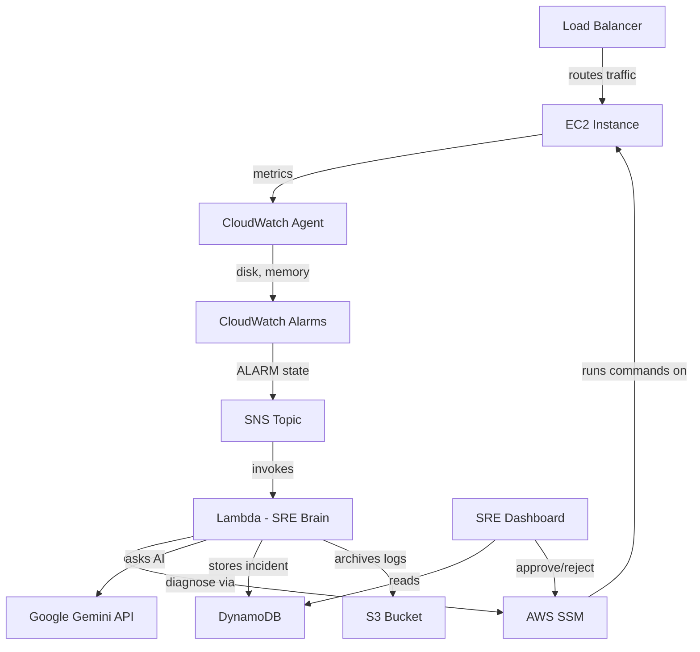
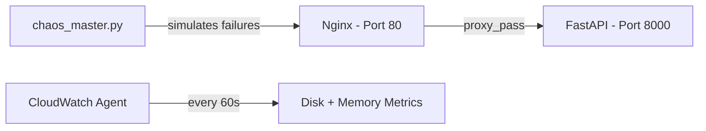
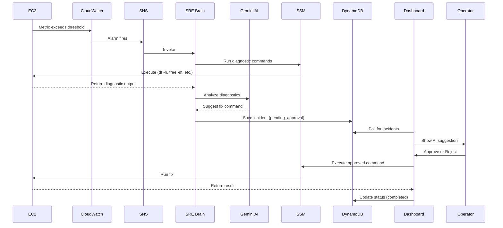
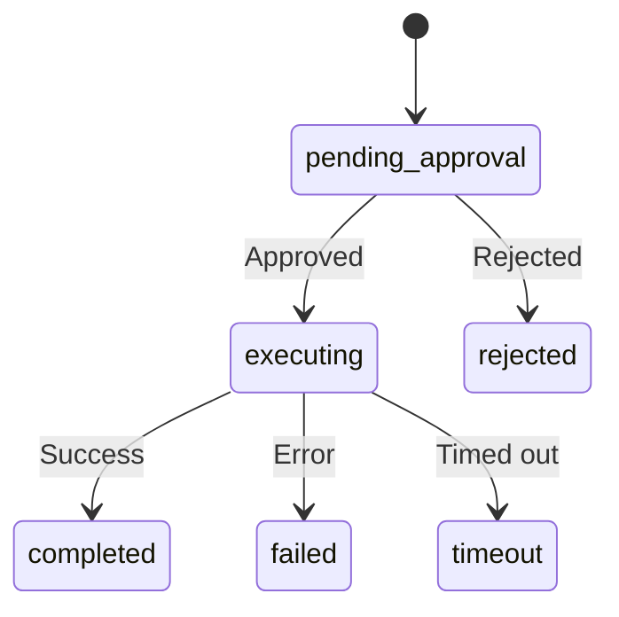
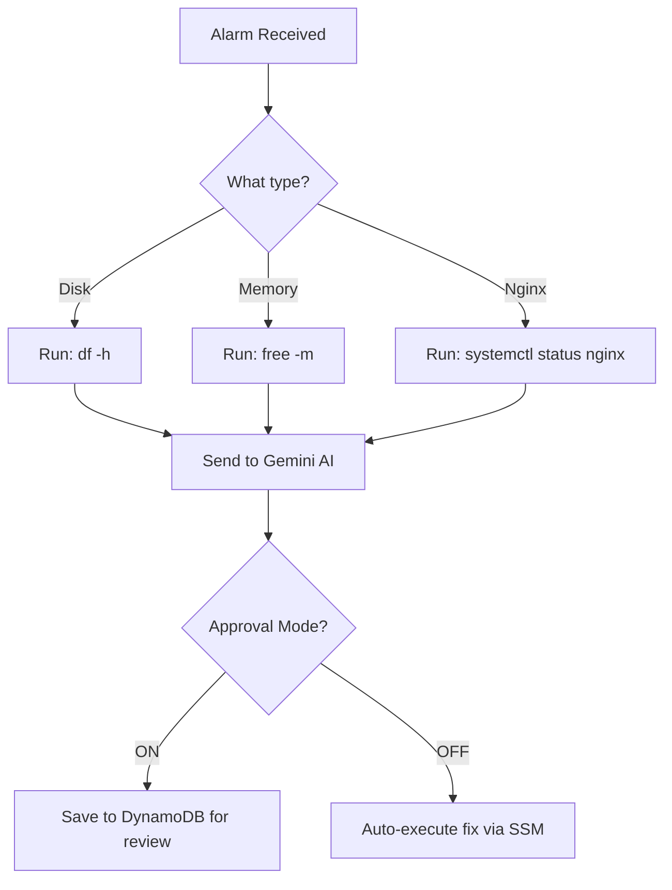

# AI SRE: Self-Healing Infrastructure — Architecture Guide

A complete technical deep-dive into how the AI-powered SRE platform works.

---

## 1. Why This Project?

| Challenge | Traditional SRE | AI SRE (This Project) |
|-----------|-----------------|----------------------|
| Detection | Human watches dashboards | CloudWatch alarms auto-trigger |
| Diagnosis | SSH into servers manually | Lambda runs diagnostics via SSM |
| Fix Planning | Engineer decides what to do | Gemini AI suggests remediation |
| Execution | Manual SSH commands | Auto-execute or human approval via dashboard |
| Reporting | Manual write-up | Auto-generated incident reports |

**Bottom line**: MTTR drops from minutes to seconds, with full audit trails.

---

## 2. High-Level Architecture



---

## 3. AWS Components

| Component | Resource Name | Purpose |
|-----------|--------------|---------|
| Compute | `sre-demo-asg` (ASG) | Auto-scales 1-2 `t3.micro` EC2 instances |
| Load Balancer | `sre-demo-alb` | Distributes HTTP traffic to EC2 |
| Monitoring | 3 CloudWatch Alarms | Disk >85%, Memory >90%, Nginx down |
| Notification | `sre-incident-alerts` (SNS) | Bridges alarms to Lambda |
| AI Engine | `sre-brain-handler` (Lambda) | Diagnoses and plans remediation |
| AI Model | Google Gemini API | Generates remediation commands |
| Database | `sre-incidents` (DynamoDB) | Tracks all incidents + timeline |
| Storage | `sre-incident-logs-archive-*` (S3) | Archives rotated logs |
| Execution | AWS SSM | Runs shell commands on EC2 remotely |

---

## 4. EC2 Instance Stack

Each EC2 instance runs the following:



- **Nginx**: Reverse proxy serving traffic on port 80
- **FastAPI**: Simple health-check app on port 8000
- **CloudWatch Agent**: Reports `disk_used_percent` and `mem_used_percent`
- **chaos_master.py**: Triggers chaos scenarios for testing

---

## 5. Incident Lifecycle

### Step-by-Step Flow



### Incident Status Flow



---

## 6. Three Monitored Scenarios

### Alarm Details

| Alarm | Trigger | Diagnostics | AI Fallback Fix |
|-------|---------|-------------|-----------------|
| `Disk-Critical-ASG` | `disk_used_percent > 85%` | `df -h`, `ls /var/log` | Archive garbage.log to S3, truncate |
| `Memory-Exhaustion-ASG` | `mem_used_percent > 90%` | `free -m`, `ps aux` | `pkill -f stress-ng` |
| `Nginx-Down-ALB` | `UnHealthyHostCount > 0` | `systemctl status nginx` | `systemctl restart nginx` |

### Lambda Decision Flow



---

## 7. Chaos Engineering

Chaos can be triggered from the dashboard UI or manually via SSM:

| Mode | What It Does | Expected Alarm |
|------|-------------|----------------|
| `disk-fill` | Writes zeros to `/var/log/garbage.log` until >85% full | `Disk-Critical-ASG` |
| `oom` | Runs `stress-ng` at 95% memory for 600s | `Memory-Exhaustion-ASG` |
| `nginx-crash` | Stops Nginx service | `Nginx-Down-ALB` |

---

## 8. DynamoDB Incident Schema

```json
{
  "incident_id": "1708300000_Disk-Critical-ASG_i-0abc123",
  "alarm_name": "Disk-Critical-ASG",
  "alarm_description": "Disk Usage > 85%",
  "instance_id": "i-0abc123def456",
  "status": "pending_approval",
  "diagnostics": "Filesystem  Size  Used Avail Use% ...",
  "ai_suggestion": "aws s3 cp /var/log/garbage.log s3://...",
  "ai_reasoning": "Disk usage critical. Archiving to S3.",
  "remediation_output": "",
  "timeline": [
    {"event": "created", "timestamp": "..."},
    {"event": "approved", "timestamp": "..."},
    {"event": "completed", "timestamp": "..."}
  ]
}
```

---

## 9. Directory Structure

```
Ai-Incident-SRE/
├── .env                    # Secrets (git-ignored)
├── .env.example
├── .gitignore
├── README.md               # Quick-start guide
├── ARCHITECTURE.md         # This file
├── CHANGELOG.md
├── LICENSE
│
├── infra/                  # Terraform IaC
│   ├── main.tf             # All AWS resources
│   ├── variables.tf        # Variable definitions
│   └── terraform.tfvars    # Secret values (git-ignored)
│
├── sre-brain/              # AI Lambda
│   └── handler.py          # Lambda handler + Gemini AI
│
├── dashboard/              # SRE Command Center
│   ├── app.py              # FastAPI backend
│   ├── requirements.txt
│   └── static/             # Frontend (HTML/CSS/JS)
│
├── vm-image/               # EC2 setup
│   ├── app.py              # Health-check app
│   └── user_data.sh        # Bootstrap script
│
├── chaos-scripts/          # Chaos engineering
│   └── chaos_master.py
├── docs/
│   └── TROUBLESHOOTING.md
└── tests/
    └── test_chaos_master.py
```
