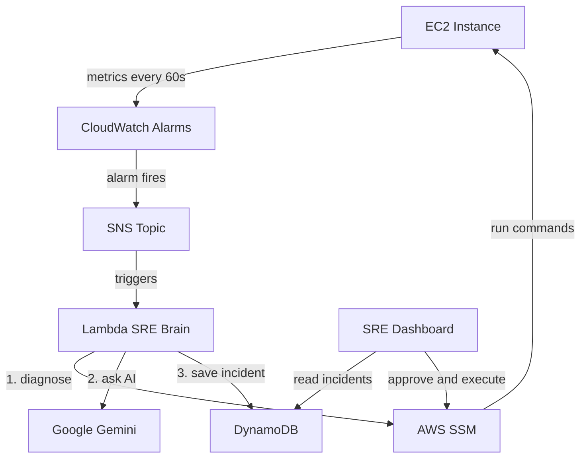

# 🤖 AI SRE: Self-Healing Infrastructure on AWS

> **An AI-powered Site Reliability Engineering platform that automatically detects, diagnoses, and remediates infrastructure incidents — reducing MTTR from minutes to seconds.**

---

## 📋 Overview

| Step | Action | Description |
|------|--------|-------------|
| 1️⃣ | **Detect** | CloudWatch Agent monitors disk, memory, Nginx on EC2 |
| 2️⃣ | **Alert** | CloudWatch Alarm fires to SNS when thresholds breach |
| 3️⃣ | **Diagnose** | Lambda runs diagnostic commands via SSM |
| 4️⃣ | **Plan** | Google Gemini AI analyzes diagnostics and suggests a fix |
| 5️⃣ | **Act** | Operator approves via dashboard (or auto-executes) |
| 6️⃣ | **Heal** | Remediation runs on server, incident closes |

---

## 🏗️ Architecture & Flow Diagram



---

## 🛠️ Tech Stack

| Layer | Technology | Purpose |
|-------|------------|---------|
| ☸️ **Infrastructure** | Terraform, AWS (EC2, ASG, ALB, Lambda, DynamoDB, S3, SNS, SSM, CloudWatch) | Provisioning, alarms, compute |
| 🧠 **AI Engine** | Google Gemini API (via Lambda) | Diagnosis, remediation suggestions |
| 📊 **Dashboard** | Python FastAPI + WebSocket + HTML/CSS/JS | Incident review, approval, metrics |
| 🌐 **Application** | Nginx reverse proxy + FastAPI health-check app | Target app, health probes |
| 💥 **Chaos** | Custom Python scripts (disk fill, OOM, Nginx crash) | Chaos engineering |

---

## 🗣️ Languages

| Language | Used In |
|----------|---------|
| **Python** | Lambda handler, dashboard, chaos scripts, vm-image app |
| **HCL** | Terraform infrastructure |
| **YAML** | CloudWatch config, CI workflows |

---

## 📁 Project Structure

```
├── infra/                  ☸️ Terraform — AWS resources
│   ├── main.tf
│   ├── variables.tf
│   ├── terraform.tfvars.example
│   └── cw-agent-config.json
├── sre-brain/              🧠 Lambda — AI incident handler
│   └── handler.py
├── dashboard/              📊 SRE Command Center — web UI
│   ├── app.py
│   ├── Dockerfile
│   ├── requirements.txt
│   └── static/
│       ├── index.html
│       ├── css/styles.css
│       └── js/app.js
├── vm-image/               🎯 EC2 bootstrap / demo app
│   ├── app.py
│   ├── user_data.sh
│   ├── requirements.txt
│   └── Dockerfile
├── chaos-scripts/          💥 Chaos engineering
│   └── chaos_master.py
├── scripts/                🔧 Build & utilities
│   ├── build-lambda.py
│   ├── build-lambda.sh
│   └── clean-infra-artifacts.sh
├── docs/                   📚 Documentation
│   ├── TROUBLESHOOTING.md
│   ├── API.md
│   ├── RUNBOOK.md
│   ├── SLO.md
│   └── architecture-decisions/
│       └── ADR-001-approval-mode.md
├── tests/                  🧪 Unit tests
│   ├── conftest.py
│   ├── test_chaos_master.py
│   ├── test_dashboard_api.py
│   ├── test_handler.py
│   └── test_vm_image.py
├── .github/                ⚙️ CI/CD & templates
│   ├── workflows/
│   │   ├── ci.yml
│   │   └── release.yml
│   ├── ISSUE_TEMPLATE/
│   ├── PULL_REQUEST_TEMPLATE.md
│   ├── dependabot.yml
│   └── CODEOWNERS
├── ARCHITECTURE.md
├── CHANGELOG.md
├── CONTRIBUTING.md
├── LICENSE
├── Makefile
├── SECURITY.md
├── docker-compose.yml
├── pyproject.toml
├── requirements-dev.txt
└── .env.example
```

---

## 🚀 Quick Start

```bash
# 1. Configure secrets
cp .env.example .env
cp infra/terraform.tfvars.example infra/terraform.tfvars   # Edit GEMINI_API_KEY

# 2. Deploy infrastructure
cd infra
terraform init
terraform apply -auto-approve

# 3. Run the dashboard
cd dashboard
pip install -r requirements.txt
python app.py
```

Visit `http://localhost:3000` (API docs: `/docs`). Use the **Chaos Panel** or SSM to trigger incidents.

📖 **Further reading:** [docs/RUNBOOK.md](docs/RUNBOOK.md) · [ARCHITECTURE.md](ARCHITECTURE.md)

---

## 👤 Author

**Sergio Sediq**

- 🔗 [GitHub](https://github.com/SergioSediq)
- 💼 [LinkedIn](https://www.linkedin.com/in/sedyagho/)
- ✉️ sediqsergio@gmail.com
